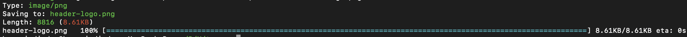

## terradn

A downloader written in Rust.
## usage

```
terradn 0.1.0
Hossein Dindar <hosseind2017@gmail.com>
A file downloader in rust

USAGE:
    terradn [FLAGS] [OPTIONS] <URL>

FLAGS:
    -c, --continue        resume getting a partially-downloaded file
    -h, --help            Prints help information
    -H, --headers         prints the headers sent by the HTTP server
    -q, --quiet           quiet (no output)
    -s, --singlethread    download using only a single thread
    -V, --version         Prints version information

OPTIONS:
    -U, --useragent <AGENT>                    identify as AGENT instead of terradn/VERSION
    -O, --output <FILE>                        write documents to FILE
    -n, --num_connections <NUM_CONNECTIONS>    maximum number of concurrent connections (default is 8)
    -T, --timeout <SECONDS>                    set all timeout values to SECONDS

ARGS:
    <URL>    url to download

```

## Installation

Via cargo

```
cargo install terradn
```

## screenshot



## license

This project is license used the MIT license. See [LICENSE](LICENSE) for more details.
